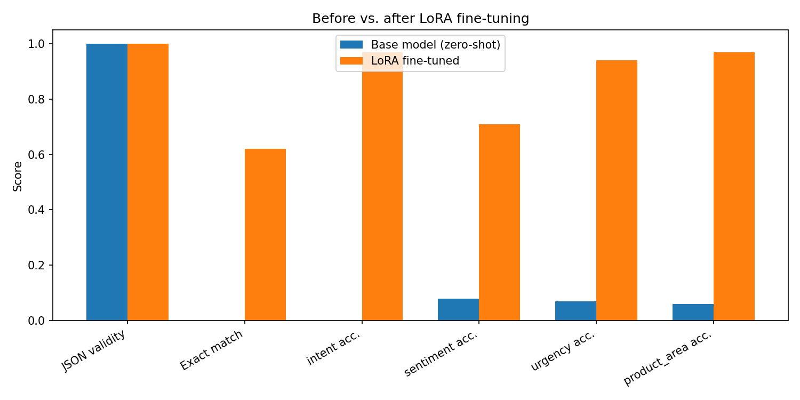

# LoRA Fine-Tuning: Support Ticket Structured Extraction

Fine-tunes a small open-source language model with **LoRA/QLoRA** to convert
raw, messy customer support messages into structured JSON — the kind of
extraction task real support/CRM systems need to route and triage tickets
automatically.

```
"The mobile app keeps crashing every time I try to log in, this is the
 second time this has happened."
```
becomes
```json
{"intent": "technical_issue", "sentiment": "frustrated", "urgency": "high", "product_area": "mobile_app"}
```

## Table of contents

- [Why this project](#why-this-project)
- [Approach](#approach)
- [Dataset](#dataset)
- [Method: LoRA/QLoRA](#method-loraqlora)
- [Results](#results)
- [Project structure](#project-structure)
- [Getting started](#getting-started)
- [Design decisions and trade-offs](#design-decisions-and-trade-offs)
- [Known limitations](#known-limitations)
- [Roadmap](#roadmap)
- [License](#license)

## Why this project

Structured extraction (turning free text into a fixed schema) is one of the
most common real-world LLM fine-tuning tasks — it shows up in support ticket
routing, document processing, and data entry automation. It's also a good
task for demonstrating fine-tuning skill specifically, because:

- Success is **measurable** (exact-match accuracy, JSON validity), not
  subjective
- A small model can be pushed from unreliable to highly reliable on a
  narrow task with a modest amount of LoRA fine-tuning — a clean before/after
  story
- It's cheap enough to run on a single free-tier GPU

## Approach

1. Generate a synthetic, labeled dataset of support messages (included in
   this repo, deterministic, no external data needed)
2. Measure the base model's zero-shot performance on the task (no
   fine-tuning at all)
3. LoRA fine-tune a small instruction-tuned model on the training set
4. Re-measure performance on the same held-out test set
5. Compare — the entire point of the project is that before/after
   comparison, not just "a model that does the task"

## Dataset

`data/generate_dataset.py` produces 1,000 synthetic examples (800 train /
100 validation / 100 test) by combining templated support-message phrasings
across:

- **6 intents**: billing_issue, technical_issue, refund_request,
  account_access, feature_request, cancellation
- **4 sentiments**: positive, neutral, negative, frustrated
- **3 urgency levels**: low, medium, high
- **5 product areas**: mobile_app, web_dashboard, api, billing_system,
  account_settings

The dataset is synthetic and templated specifically so it's safe to include
and share in this repo (no scraped or proprietary data), while still being
varied enough (multiple phrasings, random fillers, greetings, and reference
numbers) that a model has to learn the underlying pattern rather than
memorize sentence shapes. Regenerate it with a different size or seed via:

```bash
python data/generate_dataset.py --train 800 --val 100 --test 100 --seed 42
```

## Method: LoRA/QLoRA

- **Base model**: `Qwen/Qwen2.5-0.5B-Instruct` by default (small enough to
  fine-tune quickly on a free Colab T4; swap in a larger model via
  `--model_name` if you have more GPU headroom)
- **Quantization**: 4-bit (QLoRA) via `bitsandbytes`, so the base model's
  memory footprint stays small and only the LoRA adapter's parameters are
  trained in full precision
- **LoRA targets**: `q_proj`, `k_proj`, `v_proj`, `o_proj` — the attention
  projection layers, which is where most of the useful task adaptation
  happens for a task like this; leaving the rest of the model frozen keeps
  trainable parameters (and training time) low
- **Hyperparameters** (defaults in `src/train.py`, all overridable via CLI
  flags):
  - `lora_r = 16`, `lora_alpha = 32` — a common, moderate-capacity starting
    ratio (alpha = 2x r); higher `r` gives the adapter more capacity at the
    cost of more trainable parameters
  - `learning_rate = 2e-4` — typical for LoRA (LoRA adapters generally
    tolerate a higher learning rate than full fine-tuning would, since far
    fewer parameters are being updated)
  - `epochs = 3` — enough passes for a narrow, templated task like this
    without overfitting on 800 examples
- **Training library**: `trl`'s `SFTTrainer`, which handles the supervised
  fine-tuning loop (formatting, batching, loss masking) on top of Hugging
  Face `transformers` and `peft`

## Results

Evaluated on the 100-example held-out test set, comparing the base model's
zero-shot output against the same model after LoRA fine-tuning (3 epochs,
`lora_r=16`, `lora_alpha=32`, `Qwen/Qwen2.5-0.5B-Instruct`), on the current
version of the dataset where urgency and sentiment are signaled by explicit
wording:

| Metric                  | Base model (zero-shot) | LoRA fine-tuned |
|--------------------------|:----------------------:|:---------------:|
| JSON validity rate        |          100%           |       100%       |
| Exact-match accuracy       |           0%            |       62%        |
| Intent accuracy            |           0%            |       97%        |
| Sentiment accuracy          |           8%            |       71%        |
| Urgency accuracy             |           7%            |       94%        |
| Product area accuracy         |           6%            |       97%        |



**What this shows:**

- Every field improved sharply after fine-tuning, and overall exact-match
  accuracy (all four fields correct at once) went from 0% to 62% — a real,
  usable result for a 0.5B model with a single LoRA pass.
- **Intent, urgency, and product area (all 94-97%)** are essentially solved
  by fine-tuning. The base model's near-zero scores mostly weren't wrong
  reasoning — it was using its own label vocabulary (`"Immediate"` instead
  of `"high"`, `"Customer Service"` instead of `"billing_issue"`) rather
  than the exact schema the task requires. Fine-tuning taught it that exact
  closed vocabulary.
- **Sentiment (71%) is the weakest of the four**, and the errors are
  informative rather than random: in the samples above, the model mixes up
  `"negative"` and `"frustrated"` twice (e.g. predicting `negative` for a
  message whose gold label was `frustrated`). Those two labels are
  genuinely close in meaning — a message can plausibly read as either — so
  this looks like a harder, more subjective boundary rather than a
  data-generation flaw like the one found in round 1 (see below).

### Round 1 vs round 2

The first version of `generate_dataset.py` assigned `urgency` to each
example independently of the message content, so there was no genuine
signal in the text for any model to learn from:

| Metric                  | Round 1 (base) | Round 1 (fine-tuned) | Round 2 (base) | Round 2 (fine-tuned) |
|--------------------------|:---------------:|:----------------------:|:----------------:|:-----------------------:|
| Exact-match accuracy       |       0%        |           8%            |        0%        |           62%            |
| Sentiment accuracy          |       7%        |          22%            |        8%         |           71%            |
| Urgency accuracy             |      16%        |          31%            |        7%         |           94%            |

Urgency in particular went from performing at random chance (31% on a
3-way label, vs. 33% chance) to 94% once the dataset actually gave the
model something to learn from — direct evidence that the round-1 ceiling
was a dataset design flaw, not a fine-tuning or model-capacity limit. This
comparison is worth keeping in the README even though round 1 is no longer
the "current" result: it's a concrete example of diagnosing why a model
underperforms and fixing the actual cause rather than just tuning
hyperparameters blindly.

See [`results/sample_outputs.md`](results/sample_outputs.md) for the raw
before/after model outputs on individual test examples.


## Project structure

```
lora-ticket-classifier/
├── data/
│   ├── generate_dataset.py   Synthetic dataset generator
│   ├── train.jsonl            800 examples (included)
│   ├── val.jsonl               100 examples (included)
│   └── test.jsonl              100 examples (included)
├── src/
│   ├── train.py                LoRA/QLoRA fine-tuning script
│   ├── evaluate.py             Before/after evaluation + chart generation
│   └── infer.py                CLI demo for a single input
├── notebooks/
│   └── run_on_colab.ipynb      End-to-end pipeline for a free Colab GPU
├── results/
│   └── README.md               Explains what populates this folder
├── requirements.txt
├── .gitignore
├── LICENSE
└── README.md
```

## Getting started

### Option A: Google Colab (recommended, free GPU)

1. Push this repo to your own GitHub
2. Open `notebooks/run_on_colab.ipynb` in Colab (Colab -> File -> Open
   notebook -> GitHub -> paste your repo URL)
3. Runtime -> Change runtime type -> **T4 GPU**
4. Update the `git clone` URL in the first cell to your repo, then run all
   cells top to bottom
5. Total runtime: roughly 10-20 minutes for training plus a few minutes for
   evaluation, on the default settings

### Option B: Your own machine with a GPU

```bash
git clone https://github.com/YOUR_USERNAME/lora-ticket-classifier.git
cd lora-ticket-classifier
python3 -m venv venv && source venv/bin/activate
pip install -r requirements.txt

# 1. Dataset is already included, or regenerate it:
python data/generate_dataset.py

# 2. Fine-tune
python src/train.py

# 3. Evaluate base vs. fine-tuned
python src/evaluate.py

# 4. Try your own input
python src/infer.py --text "I can't log into my account and it's urgent"
```

A CUDA-capable GPU with at least ~8GB VRAM is recommended for the default
0.5B model with 4-bit quantization. CPU-only will run but will be very slow.

## Design decisions and trade-offs

- **Why LoRA/QLoRA over full fine-tuning**: full fine-tuning a model — even
  a small one — requires storing optimizer states for every parameter,
  which multiplies memory needs several times over. LoRA trains a small set
  of additional low-rank matrices instead, which fits comfortably on a free
  GPU and trains faster, at some cost to the adapter's maximum capacity
  compared to a full fine-tune.
- **Why a 0.5B model by default**: this project is meant to run end-to-end
  on a free-tier GPU in well under 30 minutes. Swapping in a larger base
  model (1B-7B range) via `--model_name` will generally improve zero-shot
  performance and may need fewer fine-tuning steps to reach the same
  accuracy, at the cost of longer training time and more VRAM.
- **Why exact-match accuracy as the primary metric**: for a structured
  extraction task, "close" isn't especially useful — a support ticket
  router either gets the right intent/urgency or it doesn't. Exact-match
  keeps the evaluation honest rather than rewarding partial credit that
  wouldn't matter in production.
- **Why measure JSON validity separately**: a model can get every field
  "correct" in spirit but fail to produce valid, parseable JSON (extra
  text, malformed brackets). Tracking this separately from field accuracy
  makes it possible to tell format-following failures apart from actual
  classification failures — worth watching for in the base model
  especially, since it hasn't been trained on this exact output format.

## Known limitations

- The dataset is synthetic and templated; real-world support messages are
  messier (typos, multiple issues in one message, non-English text) than
  what's modeled here
- No hyperparameter sweep is included — the defaults are reasonable
  starting points, not a tuned optimum
- Single-label fields only; a real ticket can have overlapping or multiple
  intents, which this schema doesn't capture
- Evaluation uses greedy decoding only (no sampling-based robustness check)

## Roadmap

- [x] Tie `urgency` and `sentiment` labels to actual keywords/phrasing in
      `generate_dataset.py` instead of assigning them independently of the
      text — done; see "Round 1 vs round 2" in Results
- [x] Re-run training and evaluation on the round-2 dataset and record the
      new numbers — done; exact-match went from 8% to 62%
- [ ] Investigate the `negative` vs `frustrated` sentiment confusion —
      possibly merge them into one label, or make the phrase banks for the
      two more distinct
- [ ] Add a small hyperparameter sweep (LoRA rank, learning rate) with
      results compared
- [ ] Add a DPO preference-tuning pass on top of the SFT model
- [ ] Test a full fine-tune vs. LoRA comparison on the same task and model
      size
- [ ] Expand the dataset with a few real (anonymized) examples to test
      generalization beyond the synthetic templates

## License

Released under the [MIT License](LICENSE).
[Uploading README.md…]()
